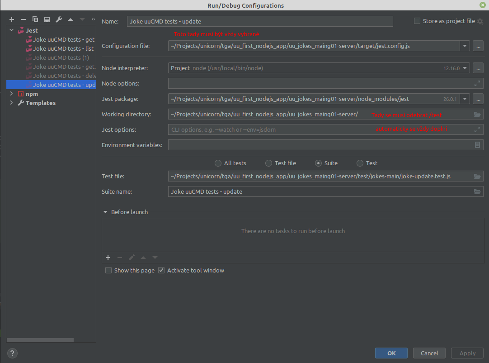

# Realizace BE v uuApp Framework I. - uuCmd

Vypracovaná samostatná práce pro běh školení `uuApp Development Standard I. 2021/05-07`.

Postupováno dle [základních příkladů](https://uuos9.plus4u.net/uu-bookkitg01-main/78462435-2590bf997d264d959b9d6a88ee1d0ff5/book/page?code=48920790).

Přidány základní uuCmd pro objekt `joke`:

- **joke/create**

```js
const jokeCreateDtoInType = shape({
  name: string(255).isRequired(),
  text: string(4000),
  image: binary()
});
```

- **joke/update**

```js
const jokeUpdateDtoInType = shape({
  id: id().isRequired(),
  name: uu5String(255),
  text: uu5String(4000),
  image: binary()
})
```

- **joke/delete**

```js
const jokeDeleteDtoInType = shape({
  id: id().isRequired()
});
```

- **joke/list**

```js
const jokeListDtoInType = shape({
  pageInfo: shape({
    pageIndex: integer(0, null),
    pageSize: integer(0, null)
  })
});
```

- **joke/get**

```js
const jokeGetDtoInType = shape({
  id: id().isRequired()
})
```

- **joke/getImage**

```js
const jokeGetImageDataDtoInType = shape({
  image: code().isRequired(),
  contentDisposition: oneOf(["inline", "attachment"])
});
```

`Joke` objekt:

```json
{
  "id": "610260791e5b6b07a3e146c9",
  "name": "...",
  "text": "...",
  "image": "5d560dbedab7b28d26b0850faf74efc1",
  "visibility": true,
  "uuIdentity": "1-1",
  "uuIdentityName": "uuIdentityName",
  "awid": "...",
  "sys": {
    "cts": "2021-08-05T07:34:31.490Z",
    "mts": "2021-08-05T07:34:31.490Z",
    "rev": 0
  }
}
```

Insomnia dodána.

---
## Testy

uuCmd jsou pokryty testy. Není uděláno pokrytí práce s obrázkem.

```
Test Suites: 7 passed, 7 total
Tests:       16 passed, 16 total
Snapshots:   0 total
Time:        11.583 s, estimated 17 s
Ran all test suites.
```

### Nastavení testů



---
## Nasazení
Deploy aplikace lze udělat pomocí `npm run deploy`.

Aktuální deploy na adrese: https://uuapp.plus4u.net/tga-trainingao-maing01/3d4a47b57b4944e1be0a9cff8ffc01d7/
